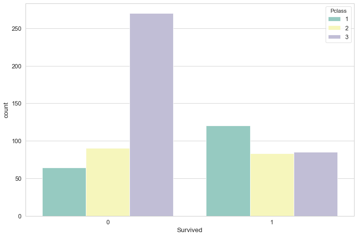

# Analysing titanic data and predicting Survivors based on Passenger class, Sex, Fare and Embarked location


### This is an attempt to participate Kaggle's Machine Learning Prediction compitition (https://www.kaggle.com/c/titanic/data)


```python
# import dependencies
import pandas as pd
import seaborn as sns
import numpy as np
import matplotlib.pyplot as plt
import math
from sklearn.model_selection import train_test_split
from sklearn.linear_model import LogisticRegression
```


```python
# Load dataset
titanic_df = pd.read_csv('data/train.csv')
```


```python
# Set default figure size
sns.set(rc={'figure.figsize':(12,8)})
```


```python
# QUick look at the data
titanic_df.head()
```


<div>
<style scoped>
    .dataframe tbody tr th:only-of-type {
        vertical-align: middle;
    }

    .dataframe tbody tr th {
        vertical-align: top;
    }

    .dataframe thead th {
        text-align: right;
    }
</style>
<table border="1" class="dataframe">
  <thead>
    <tr style="text-align: right;">
      <th></th>
      <th>PassengerId</th>
      <th>Survived</th>
      <th>Pclass</th>
      <th>Name</th>
      <th>Sex</th>
      <th>Age</th>
      <th>SibSp</th>
      <th>Parch</th>
      <th>Ticket</th>
      <th>Fare</th>
      <th>Cabin</th>
      <th>Embarked</th>
    </tr>
  </thead>
  <tbody>
    <tr>
      <th>0</th>
      <td>1</td>
      <td>0</td>
      <td>3</td>
      <td>Braund, Mr. Owen Harris</td>
      <td>male</td>
      <td>22.0</td>
      <td>1</td>
      <td>0</td>
      <td>A/5 21171</td>
      <td>7.2500</td>
      <td>NaN</td>
      <td>S</td>
    </tr>
    <tr>
      <th>1</th>
      <td>2</td>
      <td>1</td>
      <td>1</td>
      <td>Cumings, Mrs. John Bradley (Florence Briggs Th...</td>
      <td>female</td>
      <td>38.0</td>
      <td>1</td>
      <td>0</td>
      <td>PC 17599</td>
      <td>71.2833</td>
      <td>C85</td>
      <td>C</td>
    </tr>
    <tr>
      <th>2</th>
      <td>3</td>
      <td>1</td>
      <td>3</td>
      <td>Heikkinen, Miss. Laina</td>
      <td>female</td>
      <td>26.0</td>
      <td>0</td>
      <td>0</td>
      <td>STON/O2. 3101282</td>
      <td>7.9250</td>
      <td>NaN</td>
      <td>S</td>
    </tr>
    <tr>
      <th>3</th>
      <td>4</td>
      <td>1</td>
      <td>1</td>
      <td>Futrelle, Mrs. Jacques Heath (Lily May Peel)</td>
      <td>female</td>
      <td>35.0</td>
      <td>1</td>
      <td>0</td>
      <td>113803</td>
      <td>53.1000</td>
      <td>C123</td>
      <td>S</td>
    </tr>
    <tr>
      <th>4</th>
      <td>5</td>
      <td>0</td>
      <td>3</td>
      <td>Allen, Mr. William Henry</td>
      <td>male</td>
      <td>35.0</td>
      <td>0</td>
      <td>0</td>
      <td>373450</td>
      <td>8.0500</td>
      <td>NaN</td>
      <td>S</td>
    </tr>
  </tbody>
</table>
</div>


```python
# total num of passengers 
print(f'There are {len(titanic_df)} total passengers in this training dataset')
```

    There are 891 total passengers in this training dataset


# Data Cleanup


```python
# Looking at column types and count
titanic_df.info()
```

    <class 'pandas.core.frame.DataFrame'>
    RangeIndex: 891 entries, 0 to 890
    Data columns (total 12 columns):
    PassengerId    891 non-null int64
    Survived       891 non-null int64
    Pclass         891 non-null int64
    Name           891 non-null object
    Sex            891 non-null object
    Age            714 non-null float64
    SibSp          891 non-null int64
    Parch          891 non-null int64
    Ticket         891 non-null object
    Fare           891 non-null float64
    Cabin          204 non-null object
    Embarked       889 non-null object
    dtypes: float64(2), int64(5), object(5)
    memory usage: 83.6+ KB


```python
#Check for null values in each column
titanic_df.isnull().sum()
```


    PassengerId      0
    Survived         0
    Pclass           0
    Name             0
    Sex              0
    Age            177
    SibSp            0
    Parch            0
    Ticket           0
    Fare             0
    Cabin          687
    Embarked         2
    dtype: int64


```python
# Heatmap of null column values to get a better idea. Dark blue stands for null, 
# and off white means no null value ofr the respective column for each point.
sns.heatmap(titanic_df.isnull(),cmap="YlGnBu")
```


    <matplotlib.axes._subplots.AxesSubplot at 0x118cf1f28>


## We can see that about 20% of Age and majority of Cabin calues are null. 2 null values  for Embarked column also.


```python
# Drop Cabin column
titanic_df.drop('Cabin', axis=1, inplace=True)
```


```python
# Drop nulls from the dataframe
titanic_df.dropna(inplace=True)
```


```python
# Verifying that we dont have any more nulls. 
# Notice we dont see any black bars on the heatmap so all nulls have been dropped. - 

sns.heatmap(titanic_df.isnull(),cmap="YlGnBu")
```


    <matplotlib.axes._subplots.AxesSubplot at 0x127870f28>


# Data Analysis

## How many survivals for Male and Female


```python
sns.set_style("whitegrid") 
sns.countplot(x="Survived", hue="Sex", data=titanic_df, palette="Set3")
```


    <matplotlib.axes._subplots.AxesSubplot at 0x12795f278>


### Most passengers who did not survive were Male

# How many survivals by passenger class?


```python
sns.countplot(x="Survived", hue="Pclass", data=titanic_df, palette="Set3")
```


    <matplotlib.axes._subplots.AxesSubplot at 0x127b8e3c8>





### Most Passengers who did not survive belonged to Class 3 i.e the lowest class. Most people who survived belonged to Class 1, then Class 3 and then Class 2.


```python
# What was the age distribution on the titanic
titanic_df['Age'].hist()
```


    <matplotlib.axes._subplots.AxesSubplot at 0x127d4e9b0>


### As we can see, the titanic was populated by more younger people of age < 30. Which means lots of children and young adults.

## What were the ages of the survivors? What was the age distribution on the titanic


```python
titanic_df[titanic_df['Survived'] == 1]['Age'].hist()
```


    <matplotlib.axes._subplots.AxesSubplot at 0x127ef6b70>


### Ages of 20-40 were more likely to survive, followed by Ages below 5. We would be inclined to think that children were more likelt to survive but Ages 10-20 have a lower number. We need to ask ourself if that is because there were a low number of population for ages 10-20. 
#### (There were close to 40 passengers from ages 10-20 and close to 20 survived)

## Analysing the fare distribution. How many people paid what sums of fare on the ship?


```python
titanic_df['Fare'].hist(bins=20,color='y')
```


    <matplotlib.axes._subplots.AxesSubplot at 0x127faa320>


## What were the Fares of the survivors?

### Fare distribution on the titanic below - 


```python
titanic_df[titanic_df['Survived'] == 1]['Fare'].hist(color='y')
```


    <matplotlib.axes._subplots.AxesSubplot at 0x128185358>


# Analysing how many survived from the three embarking stations

### S - Southamption
### C - Cherbourg
### Q - Queenstown


```python
sns.countplot(x="Survived", hue="Embarked", data=titanic_df, palette="Set1")
```


    <matplotlib.axes._subplots.AxesSubplot at 0x12834fe80>


### Most people who survived were from Southamption, but most people who did not survive also boarded from Southamption. Its safe to say the majority of the ship came from Southamption. 

## How do the Age values match with different passenger class


```python
sns.violinplot(x='Pclass',y="Age",data=titanic_df)
sns.swarmplot(x='Pclass',y="Age",data=titanic_df,color='0.2')

```


    <matplotlib.axes._subplots.AxesSubplot at 0x1284e5898>


### The mean ages for class 1 are higher than class 2, which is higher than class 3. This is intuitive becasue richer people tend to be of older age. Class 1 fare is the most expensive so has a higher mean age.

## Putting it together, We can plot for survived/Not Survived for Males/Females by Age Group and Fare paid for the ship.

#### 0 - Not Survived
#### 1 - Survived

### Red circles are Male while Blue circle markers are Female


```python
sns.scatterplot(x="Age", y="Fare",
                      hue="Sex", data=titanic_df,palette="Set1", size="Survived")
sns.set_style("ticks", {"xtick.major.size": 12, "ytick.major.size": 12})
sns.set_context("paper", font_scale=1.4)
```


# Preparing data for Logistic Regression

### We need to convert string values into binary (0 or 1) values


```python
# Converting the Embarked column into a numerical binary value for Q,S and C. If both Q and C are 0, 
# then the value would automatically be C

embarked = pd.get_dummies(titanic_df['Embarked'], drop_first='True')
```


```python
embarked.head()
```


<div>
<style scoped>
    .dataframe tbody tr th:only-of-type {
        vertical-align: middle;
    }

    .dataframe tbody tr th {
        vertical-align: top;
    }

    .dataframe thead th {
        text-align: right;
    }
</style>
<table border="1" class="dataframe">
  <thead>
    <tr style="text-align: right;">
      <th></th>
      <th>Q</th>
      <th>S</th>
    </tr>
  </thead>
  <tbody>
    <tr>
      <th>0</th>
      <td>0</td>
      <td>1</td>
    </tr>
    <tr>
      <th>1</th>
      <td>0</td>
      <td>0</td>
    </tr>
    <tr>
      <th>2</th>
      <td>0</td>
      <td>1</td>
    </tr>
    <tr>
      <th>3</th>
      <td>0</td>
      <td>1</td>
    </tr>
    <tr>
      <th>4</th>
      <td>0</td>
      <td>1</td>
    </tr>
  </tbody>
</table>
</div>


```python
# Converting the P assenger Class column into a numerical binary value for 1,2,3. If both 2 and 3 are 0, 
# then the value would automatically be class 1

pcl = pd.get_dummies(titanic_df['Pclass'], drop_first='True')
pcl.head()
```


<div>
<style scoped>
    .dataframe tbody tr th:only-of-type {
        vertical-align: middle;
    }

    .dataframe tbody tr th {
        vertical-align: top;
    }

    .dataframe thead th {
        text-align: right;
    }
</style>
<table border="1" class="dataframe">
  <thead>
    <tr style="text-align: right;">
      <th></th>
      <th>2</th>
      <th>3</th>
    </tr>
  </thead>
  <tbody>
    <tr>
      <th>0</th>
      <td>0</td>
      <td>1</td>
    </tr>
    <tr>
      <th>1</th>
      <td>0</td>
      <td>0</td>
    </tr>
    <tr>
      <th>2</th>
      <td>0</td>
      <td>1</td>
    </tr>
    <tr>
      <th>3</th>
      <td>0</td>
      <td>0</td>
    </tr>
    <tr>
      <th>4</th>
      <td>0</td>
      <td>1</td>
    </tr>
  </tbody>
</table>
</div>


```python
# Converting Sec column to a binary. If Male = 0, then the value would be a female automatically
sex = pd.get_dummies(titanic_df['Sex'], drop_first='True')
sex.head()
```


<div>
<style scoped>
    .dataframe tbody tr th:only-of-type {
        vertical-align: middle;
    }

    .dataframe tbody tr th {
        vertical-align: top;
    }

    .dataframe thead th {
        text-align: right;
    }
</style>
<table border="1" class="dataframe">
  <thead>
    <tr style="text-align: right;">
      <th></th>
      <th>male</th>
    </tr>
  </thead>
  <tbody>
    <tr>
      <th>0</th>
      <td>1</td>
    </tr>
    <tr>
      <th>1</th>
      <td>0</td>
    </tr>
    <tr>
      <th>2</th>
      <td>0</td>
    </tr>
    <tr>
      <th>3</th>
      <td>0</td>
    </tr>
    <tr>
      <th>4</th>
      <td>1</td>
    </tr>
  </tbody>
</table>
</div>


```python
# Combining the above dataframe to our titanic dataframe
titanic_df = pd.concat([titanic_df, embarked, pcl, sex], axis=1)
```


```python
titanic_df.head()
```


<div>
<style scoped>
    .dataframe tbody tr th:only-of-type {
        vertical-align: middle;
    }

    .dataframe tbody tr th {
        vertical-align: top;
    }

    .dataframe thead th {
        text-align: right;
    }
</style>
<table border="1" class="dataframe">
  <thead>
    <tr style="text-align: right;">
      <th></th>
      <th>PassengerId</th>
      <th>Survived</th>
      <th>Pclass</th>
      <th>Name</th>
      <th>Sex</th>
      <th>Age</th>
      <th>SibSp</th>
      <th>Parch</th>
      <th>Ticket</th>
      <th>Fare</th>
      <th>Embarked</th>
      <th>Q</th>
      <th>S</th>
      <th>2</th>
      <th>3</th>
      <th>male</th>
    </tr>
  </thead>
  <tbody>
    <tr>
      <th>0</th>
      <td>1</td>
      <td>0</td>
      <td>3</td>
      <td>Braund, Mr. Owen Harris</td>
      <td>male</td>
      <td>22.0</td>
      <td>1</td>
      <td>0</td>
      <td>A/5 21171</td>
      <td>7.2500</td>
      <td>S</td>
      <td>0</td>
      <td>1</td>
      <td>0</td>
      <td>1</td>
      <td>1</td>
    </tr>
    <tr>
      <th>1</th>
      <td>2</td>
      <td>1</td>
      <td>1</td>
      <td>Cumings, Mrs. John Bradley (Florence Briggs Th...</td>
      <td>female</td>
      <td>38.0</td>
      <td>1</td>
      <td>0</td>
      <td>PC 17599</td>
      <td>71.2833</td>
      <td>C</td>
      <td>0</td>
      <td>0</td>
      <td>0</td>
      <td>0</td>
      <td>0</td>
    </tr>
    <tr>
      <th>2</th>
      <td>3</td>
      <td>1</td>
      <td>3</td>
      <td>Heikkinen, Miss. Laina</td>
      <td>female</td>
      <td>26.0</td>
      <td>0</td>
      <td>0</td>
      <td>STON/O2. 3101282</td>
      <td>7.9250</td>
      <td>S</td>
      <td>0</td>
      <td>1</td>
      <td>0</td>
      <td>1</td>
      <td>0</td>
    </tr>
    <tr>
      <th>3</th>
      <td>4</td>
      <td>1</td>
      <td>1</td>
      <td>Futrelle, Mrs. Jacques Heath (Lily May Peel)</td>
      <td>female</td>
      <td>35.0</td>
      <td>1</td>
      <td>0</td>
      <td>113803</td>
      <td>53.1000</td>
      <td>S</td>
      <td>0</td>
      <td>1</td>
      <td>0</td>
      <td>0</td>
      <td>0</td>
    </tr>
    <tr>
      <th>4</th>
      <td>5</td>
      <td>0</td>
      <td>3</td>
      <td>Allen, Mr. William Henry</td>
      <td>male</td>
      <td>35.0</td>
      <td>0</td>
      <td>0</td>
      <td>373450</td>
      <td>8.0500</td>
      <td>S</td>
      <td>0</td>
      <td>1</td>
      <td>0</td>
      <td>1</td>
      <td>1</td>
    </tr>
  </tbody>
</table>
</div>


```python
df_binary = titanic_df[["Survived","SibSp","Parch","Fare","Q","S",2,3,"male"]]
```


```python
# Final dataset for Regression
df_binary.head()
```


<div>
<style scoped>
    .dataframe tbody tr th:only-of-type {
        vertical-align: middle;
    }

    .dataframe tbody tr th {
        vertical-align: top;
    }

    .dataframe thead th {
        text-align: right;
    }
</style>
<table border="1" class="dataframe">
  <thead>
    <tr style="text-align: right;">
      <th></th>
      <th>Survived</th>
      <th>SibSp</th>
      <th>Parch</th>
      <th>Fare</th>
      <th>Q</th>
      <th>S</th>
      <th>2</th>
      <th>3</th>
      <th>male</th>
    </tr>
  </thead>
  <tbody>
    <tr>
      <th>0</th>
      <td>0</td>
      <td>1</td>
      <td>0</td>
      <td>7.2500</td>
      <td>0</td>
      <td>1</td>
      <td>0</td>
      <td>1</td>
      <td>1</td>
    </tr>
    <tr>
      <th>1</th>
      <td>1</td>
      <td>1</td>
      <td>0</td>
      <td>71.2833</td>
      <td>0</td>
      <td>0</td>
      <td>0</td>
      <td>0</td>
      <td>0</td>
    </tr>
    <tr>
      <th>2</th>
      <td>1</td>
      <td>0</td>
      <td>0</td>
      <td>7.9250</td>
      <td>0</td>
      <td>1</td>
      <td>0</td>
      <td>1</td>
      <td>0</td>
    </tr>
    <tr>
      <th>3</th>
      <td>1</td>
      <td>1</td>
      <td>0</td>
      <td>53.1000</td>
      <td>0</td>
      <td>1</td>
      <td>0</td>
      <td>0</td>
      <td>0</td>
    </tr>
    <tr>
      <th>4</th>
      <td>0</td>
      <td>0</td>
      <td>0</td>
      <td>8.0500</td>
      <td>0</td>
      <td>1</td>
      <td>0</td>
      <td>1</td>
      <td>1</td>
    </tr>
  </tbody>
</table>
</div>


# Logistic Regression

# Performing Machine Learning on the dataset prepared - 


```python
# Assigning dependant and independant variables 

# Survived column is our dependant variable. We are trying to predict this variable
y = df_binary['Survived']

# The other columns are out independant variables. Hence we will drop Survived column from the dataframe
X = df_binary.drop('Survived', axis = 1)
```


```python
X_train, X_test, y_train, y_test = train_test_split(X,y,test_size=0.2, random_state=1)
```


```python
classifier = LogisticRegression()
classifier
```


    LogisticRegression(C=1.0, class_weight=None, dual=False, fit_intercept=True,
                       intercept_scaling=1, l1_ratio=None, max_iter=100,
                       multi_class='warn', n_jobs=None, penalty='l2',
                       random_state=None, solver='warn', tol=0.0001, verbose=0,
                       warm_start=False)


```python
 classifier.fit(X_train, y_train)
```

    /anaconda3/lib/python3.7/site-packages/sklearn/linear_model/logistic.py:432: FutureWarning: Default solver will be changed to 'lbfgs' in 0.22. Specify a solver to silence this warning.
      FutureWarning)


    LogisticRegression(C=1.0, class_weight=None, dual=False, fit_intercept=True,
                       intercept_scaling=1, l1_ratio=None, max_iter=100,
                       multi_class='warn', n_jobs=None, penalty='l2',
                       random_state=None, solver='warn', tol=0.0001, verbose=0,
                       warm_start=False)


```python
print(f"Training Data Score: {classifier.score(X_train, y_train)}")
print(f"Testing Data Score: {classifier.score(X_test, y_test)}")
```

    Training Data Score: 0.7978910369068541
    Testing Data Score: 0.7482517482517482


```python
# Predict
predictions = classifier.predict(X_test)
predictions
```


    array([1, 1, 0, 1, 1, 0, 1, 1, 0, 0, 0, 0, 0, 0, 0, 0, 0, 0, 0, 0, 0, 1,
           0, 0, 0, 1, 0, 1, 1, 0, 0, 1, 1, 1, 0, 0, 0, 1, 0, 0, 0, 0, 0, 1,
           1, 0, 0, 0, 1, 0, 1, 0, 0, 0, 0, 1, 0, 0, 1, 1, 1, 1, 0, 0, 1, 0,
           1, 0, 1, 1, 0, 1, 0, 0, 1, 0, 1, 1, 0, 1, 1, 0, 1, 1, 1, 0, 0, 0,
           0, 0, 1, 1, 1, 0, 0, 0, 0, 0, 1, 0, 0, 1, 0, 1, 0, 1, 0, 0, 1, 1,
           0, 0, 1, 0, 0, 0, 1, 0, 1, 0, 0, 0, 0, 0, 0, 1, 1, 0, 0, 1, 1, 1,
           0, 0, 1, 0, 0, 0, 0, 1, 0, 1, 0])


```python
# Comparison of our prediction with actual result
pd.DataFrame({"Prediction": predictions, "Actual": y_test})
```


<div>
<style scoped>
    .dataframe tbody tr th:only-of-type {
        vertical-align: middle;
    }

    .dataframe tbody tr th {
        vertical-align: top;
    }

    .dataframe thead th {
        text-align: right;
    }
</style>
<table border="1" class="dataframe">
  <thead>
    <tr style="text-align: right;">
      <th></th>
      <th>Prediction</th>
      <th>Actual</th>
    </tr>
  </thead>
  <tbody>
    <tr>
      <th>689</th>
      <td>1</td>
      <td>1</td>
    </tr>
    <tr>
      <th>279</th>
      <td>1</td>
      <td>1</td>
    </tr>
    <tr>
      <th>508</th>
      <td>0</td>
      <td>0</td>
    </tr>
    <tr>
      <th>9</th>
      <td>1</td>
      <td>1</td>
    </tr>
    <tr>
      <th>496</th>
      <td>1</td>
      <td>1</td>
    </tr>
    <tr>
      <th>150</th>
      <td>0</td>
      <td>0</td>
    </tr>
    <tr>
      <th>474</th>
      <td>1</td>
      <td>0</td>
    </tr>
    <tr>
      <th>469</th>
      <td>1</td>
      <td>1</td>
    </tr>
    <tr>
      <th>794</th>
      <td>0</td>
      <td>0</td>
    </tr>
    <tr>
      <th>864</th>
      <td>0</td>
      <td>0</td>
    </tr>
    <tr>
      <th>553</th>
      <td>0</td>
      <td>1</td>
    </tr>
    <tr>
      <th>226</th>
      <td>0</td>
      <td>1</td>
    </tr>
    <tr>
      <th>204</th>
      <td>0</td>
      <td>1</td>
    </tr>
    <tr>
      <th>713</th>
      <td>0</td>
      <td>0</td>
    </tr>
    <tr>
      <th>751</th>
      <td>0</td>
      <td>1</td>
    </tr>
    <tr>
      <th>349</th>
      <td>0</td>
      <td>0</td>
    </tr>
    <tr>
      <th>74</th>
      <td>0</td>
      <td>1</td>
    </tr>
    <tr>
      <th>321</th>
      <td>0</td>
      <td>0</td>
    </tr>
    <tr>
      <th>743</th>
      <td>0</td>
      <td>0</td>
    </tr>
    <tr>
      <th>873</th>
      <td>0</td>
      <td>0</td>
    </tr>
    <tr>
      <th>647</th>
      <td>0</td>
      <td>1</td>
    </tr>
    <tr>
      <th>327</th>
      <td>1</td>
      <td>1</td>
    </tr>
    <tr>
      <th>684</th>
      <td>0</td>
      <td>0</td>
    </tr>
    <tr>
      <th>769</th>
      <td>0</td>
      <td>0</td>
    </tr>
    <tr>
      <th>91</th>
      <td>0</td>
      <td>0</td>
    </tr>
    <tr>
      <th>272</th>
      <td>1</td>
      <td>1</td>
    </tr>
    <tr>
      <th>770</th>
      <td>0</td>
      <td>0</td>
    </tr>
    <tr>
      <th>27</th>
      <td>1</td>
      <td>0</td>
    </tr>
    <tr>
      <th>141</th>
      <td>1</td>
      <td>1</td>
    </tr>
    <tr>
      <th>733</th>
      <td>0</td>
      <td>0</td>
    </tr>
    <tr>
      <th>...</th>
      <td>...</td>
      <td>...</td>
    </tr>
    <tr>
      <th>741</th>
      <td>0</td>
      <td>0</td>
    </tr>
    <tr>
      <th>636</th>
      <td>0</td>
      <td>0</td>
    </tr>
    <tr>
      <th>672</th>
      <td>0</td>
      <td>0</td>
    </tr>
    <tr>
      <th>345</th>
      <td>1</td>
      <td>1</td>
    </tr>
    <tr>
      <th>68</th>
      <td>0</td>
      <td>1</td>
    </tr>
    <tr>
      <th>357</th>
      <td>1</td>
      <td>0</td>
    </tr>
    <tr>
      <th>514</th>
      <td>0</td>
      <td>0</td>
    </tr>
    <tr>
      <th>81</th>
      <td>0</td>
      <td>1</td>
    </tr>
    <tr>
      <th>231</th>
      <td>0</td>
      <td>0</td>
    </tr>
    <tr>
      <th>881</th>
      <td>0</td>
      <td>0</td>
    </tr>
    <tr>
      <th>174</th>
      <td>0</td>
      <td>0</td>
    </tr>
    <tr>
      <th>188</th>
      <td>0</td>
      <td>0</td>
    </tr>
    <tr>
      <th>419</th>
      <td>1</td>
      <td>0</td>
    </tr>
    <tr>
      <th>319</th>
      <td>1</td>
      <td>1</td>
    </tr>
    <tr>
      <th>876</th>
      <td>0</td>
      <td>0</td>
    </tr>
    <tr>
      <th>808</th>
      <td>0</td>
      <td>0</td>
    </tr>
    <tr>
      <th>706</th>
      <td>1</td>
      <td>1</td>
    </tr>
    <tr>
      <th>534</th>
      <td>1</td>
      <td>0</td>
    </tr>
    <tr>
      <th>554</th>
      <td>1</td>
      <td>1</td>
    </tr>
    <tr>
      <th>90</th>
      <td>0</td>
      <td>0</td>
    </tr>
    <tr>
      <th>99</th>
      <td>0</td>
      <td>0</td>
    </tr>
    <tr>
      <th>608</th>
      <td>1</td>
      <td>1</td>
    </tr>
    <tr>
      <th>869</th>
      <td>0</td>
      <td>1</td>
    </tr>
    <tr>
      <th>148</th>
      <td>0</td>
      <td>0</td>
    </tr>
    <tr>
      <th>666</th>
      <td>0</td>
      <td>0</td>
    </tr>
    <tr>
      <th>582</th>
      <td>0</td>
      <td>0</td>
    </tr>
    <tr>
      <th>44</th>
      <td>1</td>
      <td>1</td>
    </tr>
    <tr>
      <th>236</th>
      <td>0</td>
      <td>0</td>
    </tr>
    <tr>
      <th>780</th>
      <td>1</td>
      <td>1</td>
    </tr>
    <tr>
      <th>884</th>
      <td>0</td>
      <td>0</td>
    </tr>
  </tbody>
</table>
<p>143 rows × 2 columns</p>
</div>


```python
from sklearn.metrics import classification_report, accuracy_score
```


```python
print(classification_report(predictions, y_test))
```

                  precision    recall  f1-score   support
    
               0       0.80      0.78      0.79        87
               1       0.67      0.70      0.68        56
    
        accuracy                           0.75       143
       macro avg       0.74      0.74      0.74       143
    weighted avg       0.75      0.75      0.75       143
    


## Accuracy of our model


```python
accuracy_score(predictions,y_test)
```


    0.7482517482517482


## Testing Kaggle's test dataset


```python
test_df = pd.read_csv('data/test.csv')
```


```python
passengerId = test_df['PassengerId']
```


```python
test_df.head()
```


<div>
<style scoped>
    .dataframe tbody tr th:only-of-type {
        vertical-align: middle;
    }

    .dataframe tbody tr th {
        vertical-align: top;
    }

    .dataframe thead th {
        text-align: right;
    }
</style>
<table border="1" class="dataframe">
  <thead>
    <tr style="text-align: right;">
      <th></th>
      <th>PassengerId</th>
      <th>Pclass</th>
      <th>Name</th>
      <th>Sex</th>
      <th>Age</th>
      <th>SibSp</th>
      <th>Parch</th>
      <th>Ticket</th>
      <th>Fare</th>
      <th>Cabin</th>
      <th>Embarked</th>
    </tr>
  </thead>
  <tbody>
    <tr>
      <th>0</th>
      <td>892</td>
      <td>3</td>
      <td>Kelly, Mr. James</td>
      <td>male</td>
      <td>34.5</td>
      <td>0</td>
      <td>0</td>
      <td>330911</td>
      <td>7.8292</td>
      <td>NaN</td>
      <td>Q</td>
    </tr>
    <tr>
      <th>1</th>
      <td>893</td>
      <td>3</td>
      <td>Wilkes, Mrs. James (Ellen Needs)</td>
      <td>female</td>
      <td>47.0</td>
      <td>1</td>
      <td>0</td>
      <td>363272</td>
      <td>7.0000</td>
      <td>NaN</td>
      <td>S</td>
    </tr>
    <tr>
      <th>2</th>
      <td>894</td>
      <td>2</td>
      <td>Myles, Mr. Thomas Francis</td>
      <td>male</td>
      <td>62.0</td>
      <td>0</td>
      <td>0</td>
      <td>240276</td>
      <td>9.6875</td>
      <td>NaN</td>
      <td>Q</td>
    </tr>
    <tr>
      <th>3</th>
      <td>895</td>
      <td>3</td>
      <td>Wirz, Mr. Albert</td>
      <td>male</td>
      <td>27.0</td>
      <td>0</td>
      <td>0</td>
      <td>315154</td>
      <td>8.6625</td>
      <td>NaN</td>
      <td>S</td>
    </tr>
    <tr>
      <th>4</th>
      <td>896</td>
      <td>3</td>
      <td>Hirvonen, Mrs. Alexander (Helga E Lindqvist)</td>
      <td>female</td>
      <td>22.0</td>
      <td>1</td>
      <td>1</td>
      <td>3101298</td>
      <td>12.2875</td>
      <td>NaN</td>
      <td>S</td>
    </tr>
  </tbody>
</table>
</div>


#### Prepare/Clean Kaggle's test data for our model


```python
# Converting the Embarked column into a numerical binary value for Q,S and C. If both Q and C are 0, 
# then the value would automatically be C

embarked_test = pd.get_dummies(test_df['Embarked'], drop_first='True')
pcl_test = pd.get_dummies(test_df['Pclass'], drop_first='True')
sex_test = pd.get_dummies(test_df['Sex'], drop_first='True')
test_df = pd.concat([test_df, embarked_test, pcl_test, sex_test], axis=1)
test_df = test_df[["SibSp","Parch","Fare","Q","S",2,3,"male"]]
test_df.head()
```


<div>
<style scoped>
    .dataframe tbody tr th:only-of-type {
        vertical-align: middle;
    }

    .dataframe tbody tr th {
        vertical-align: top;
    }

    .dataframe thead th {
        text-align: right;
    }
</style>
<table border="1" class="dataframe">
  <thead>
    <tr style="text-align: right;">
      <th></th>
      <th>SibSp</th>
      <th>Parch</th>
      <th>Fare</th>
      <th>Q</th>
      <th>S</th>
      <th>2</th>
      <th>3</th>
      <th>male</th>
    </tr>
  </thead>
  <tbody>
    <tr>
      <th>0</th>
      <td>0</td>
      <td>0</td>
      <td>7.8292</td>
      <td>1</td>
      <td>0</td>
      <td>0</td>
      <td>1</td>
      <td>1</td>
    </tr>
    <tr>
      <th>1</th>
      <td>1</td>
      <td>0</td>
      <td>7.0000</td>
      <td>0</td>
      <td>1</td>
      <td>0</td>
      <td>1</td>
      <td>0</td>
    </tr>
    <tr>
      <th>2</th>
      <td>0</td>
      <td>0</td>
      <td>9.6875</td>
      <td>1</td>
      <td>0</td>
      <td>1</td>
      <td>0</td>
      <td>1</td>
    </tr>
    <tr>
      <th>3</th>
      <td>0</td>
      <td>0</td>
      <td>8.6625</td>
      <td>0</td>
      <td>1</td>
      <td>0</td>
      <td>1</td>
      <td>1</td>
    </tr>
    <tr>
      <th>4</th>
      <td>1</td>
      <td>1</td>
      <td>12.2875</td>
      <td>0</td>
      <td>1</td>
      <td>0</td>
      <td>1</td>
      <td>0</td>
    </tr>
  </tbody>
</table>
</div>


## Make Predictions using our model with Kaggle's test dataset


```python

```


<div>
<style scoped>
    .dataframe tbody tr th:only-of-type {
        vertical-align: middle;
    }

    .dataframe tbody tr th {
        vertical-align: top;
    }

    .dataframe thead th {
        text-align: right;
    }
</style>
<table border="1" class="dataframe">
  <thead>
    <tr style="text-align: right;">
      <th></th>
      <th>SibSp</th>
      <th>Parch</th>
      <th>Fare</th>
      <th>Q</th>
      <th>S</th>
      <th>2</th>
      <th>3</th>
      <th>male</th>
    </tr>
  </thead>
  <tbody>
    <tr>
      <th>0</th>
      <td>1</td>
      <td>0</td>
      <td>7.2500</td>
      <td>0</td>
      <td>1</td>
      <td>0</td>
      <td>1</td>
      <td>1</td>
    </tr>
    <tr>
      <th>1</th>
      <td>1</td>
      <td>0</td>
      <td>71.2833</td>
      <td>0</td>
      <td>0</td>
      <td>0</td>
      <td>0</td>
      <td>0</td>
    </tr>
    <tr>
      <th>2</th>
      <td>0</td>
      <td>0</td>
      <td>7.9250</td>
      <td>0</td>
      <td>1</td>
      <td>0</td>
      <td>1</td>
      <td>0</td>
    </tr>
    <tr>
      <th>3</th>
      <td>1</td>
      <td>0</td>
      <td>53.1000</td>
      <td>0</td>
      <td>1</td>
      <td>0</td>
      <td>0</td>
      <td>0</td>
    </tr>
    <tr>
      <th>4</th>
      <td>0</td>
      <td>0</td>
      <td>8.0500</td>
      <td>0</td>
      <td>1</td>
      <td>0</td>
      <td>1</td>
      <td>1</td>
    </tr>
  </tbody>
</table>
</div>


```python
test_df.isnull().count()
```


    SibSp    418
    Parch    418
    Fare     418
    Q        418
    S        418
    2        418
    3        418
    male     418
    dtype: int64


```python
test_df = test_df.fillna(test_df.mean())
```


```python
prediction = classifier.predict(test_df)
```


```python
output = pd.DataFrame({"PassengerId": passengerId,"Survived" : prediction})
```


```python
output
```


<div>
<style scoped>
    .dataframe tbody tr th:only-of-type {
        vertical-align: middle;
    }

    .dataframe tbody tr th {
        vertical-align: top;
    }

    .dataframe thead th {
        text-align: right;
    }
</style>
<table border="1" class="dataframe">
  <thead>
    <tr style="text-align: right;">
      <th></th>
      <th>PassengerId</th>
      <th>Survived</th>
    </tr>
  </thead>
  <tbody>
    <tr>
      <th>0</th>
      <td>892</td>
      <td>0</td>
    </tr>
    <tr>
      <th>1</th>
      <td>893</td>
      <td>1</td>
    </tr>
    <tr>
      <th>2</th>
      <td>894</td>
      <td>0</td>
    </tr>
    <tr>
      <th>3</th>
      <td>895</td>
      <td>0</td>
    </tr>
    <tr>
      <th>4</th>
      <td>896</td>
      <td>1</td>
    </tr>
    <tr>
      <th>5</th>
      <td>897</td>
      <td>0</td>
    </tr>
    <tr>
      <th>6</th>
      <td>898</td>
      <td>1</td>
    </tr>
    <tr>
      <th>7</th>
      <td>899</td>
      <td>0</td>
    </tr>
    <tr>
      <th>8</th>
      <td>900</td>
      <td>1</td>
    </tr>
    <tr>
      <th>9</th>
      <td>901</td>
      <td>0</td>
    </tr>
    <tr>
      <th>10</th>
      <td>902</td>
      <td>0</td>
    </tr>
    <tr>
      <th>11</th>
      <td>903</td>
      <td>0</td>
    </tr>
    <tr>
      <th>12</th>
      <td>904</td>
      <td>1</td>
    </tr>
    <tr>
      <th>13</th>
      <td>905</td>
      <td>0</td>
    </tr>
    <tr>
      <th>14</th>
      <td>906</td>
      <td>1</td>
    </tr>
    <tr>
      <th>15</th>
      <td>907</td>
      <td>1</td>
    </tr>
    <tr>
      <th>16</th>
      <td>908</td>
      <td>0</td>
    </tr>
    <tr>
      <th>17</th>
      <td>909</td>
      <td>0</td>
    </tr>
    <tr>
      <th>18</th>
      <td>910</td>
      <td>1</td>
    </tr>
    <tr>
      <th>19</th>
      <td>911</td>
      <td>1</td>
    </tr>
    <tr>
      <th>20</th>
      <td>912</td>
      <td>0</td>
    </tr>
    <tr>
      <th>21</th>
      <td>913</td>
      <td>0</td>
    </tr>
    <tr>
      <th>22</th>
      <td>914</td>
      <td>1</td>
    </tr>
    <tr>
      <th>23</th>
      <td>915</td>
      <td>0</td>
    </tr>
    <tr>
      <th>24</th>
      <td>916</td>
      <td>1</td>
    </tr>
    <tr>
      <th>25</th>
      <td>917</td>
      <td>0</td>
    </tr>
    <tr>
      <th>26</th>
      <td>918</td>
      <td>1</td>
    </tr>
    <tr>
      <th>27</th>
      <td>919</td>
      <td>0</td>
    </tr>
    <tr>
      <th>28</th>
      <td>920</td>
      <td>0</td>
    </tr>
    <tr>
      <th>29</th>
      <td>921</td>
      <td>0</td>
    </tr>
    <tr>
      <th>...</th>
      <td>...</td>
      <td>...</td>
    </tr>
    <tr>
      <th>388</th>
      <td>1280</td>
      <td>0</td>
    </tr>
    <tr>
      <th>389</th>
      <td>1281</td>
      <td>0</td>
    </tr>
    <tr>
      <th>390</th>
      <td>1282</td>
      <td>0</td>
    </tr>
    <tr>
      <th>391</th>
      <td>1283</td>
      <td>1</td>
    </tr>
    <tr>
      <th>392</th>
      <td>1284</td>
      <td>0</td>
    </tr>
    <tr>
      <th>393</th>
      <td>1285</td>
      <td>0</td>
    </tr>
    <tr>
      <th>394</th>
      <td>1286</td>
      <td>0</td>
    </tr>
    <tr>
      <th>395</th>
      <td>1287</td>
      <td>1</td>
    </tr>
    <tr>
      <th>396</th>
      <td>1288</td>
      <td>0</td>
    </tr>
    <tr>
      <th>397</th>
      <td>1289</td>
      <td>1</td>
    </tr>
    <tr>
      <th>398</th>
      <td>1290</td>
      <td>0</td>
    </tr>
    <tr>
      <th>399</th>
      <td>1291</td>
      <td>0</td>
    </tr>
    <tr>
      <th>400</th>
      <td>1292</td>
      <td>1</td>
    </tr>
    <tr>
      <th>401</th>
      <td>1293</td>
      <td>0</td>
    </tr>
    <tr>
      <th>402</th>
      <td>1294</td>
      <td>1</td>
    </tr>
    <tr>
      <th>403</th>
      <td>1295</td>
      <td>0</td>
    </tr>
    <tr>
      <th>404</th>
      <td>1296</td>
      <td>0</td>
    </tr>
    <tr>
      <th>405</th>
      <td>1297</td>
      <td>0</td>
    </tr>
    <tr>
      <th>406</th>
      <td>1298</td>
      <td>0</td>
    </tr>
    <tr>
      <th>407</th>
      <td>1299</td>
      <td>1</td>
    </tr>
    <tr>
      <th>408</th>
      <td>1300</td>
      <td>1</td>
    </tr>
    <tr>
      <th>409</th>
      <td>1301</td>
      <td>1</td>
    </tr>
    <tr>
      <th>410</th>
      <td>1302</td>
      <td>1</td>
    </tr>
    <tr>
      <th>411</th>
      <td>1303</td>
      <td>1</td>
    </tr>
    <tr>
      <th>412</th>
      <td>1304</td>
      <td>1</td>
    </tr>
    <tr>
      <th>413</th>
      <td>1305</td>
      <td>0</td>
    </tr>
    <tr>
      <th>414</th>
      <td>1306</td>
      <td>1</td>
    </tr>
    <tr>
      <th>415</th>
      <td>1307</td>
      <td>0</td>
    </tr>
    <tr>
      <th>416</th>
      <td>1308</td>
      <td>0</td>
    </tr>
    <tr>
      <th>417</th>
      <td>1309</td>
      <td>0</td>
    </tr>
  </tbody>
</table>
<p>418 rows × 2 columns</p>
</div>


```python
#export output to csv 
output.to_csv('data/output.csv',index=False)
```


```python

```
